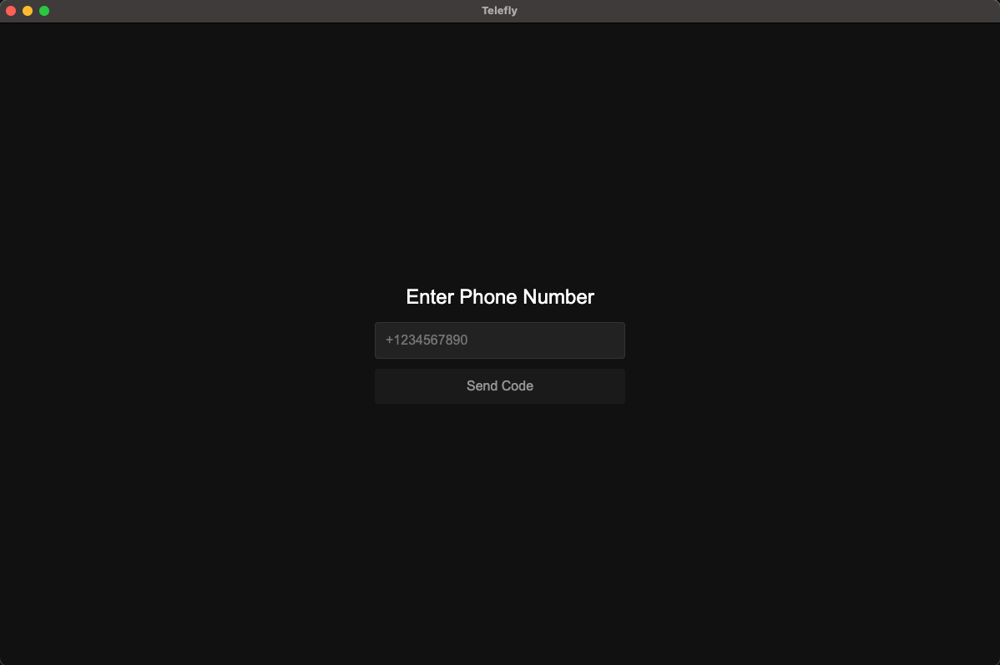
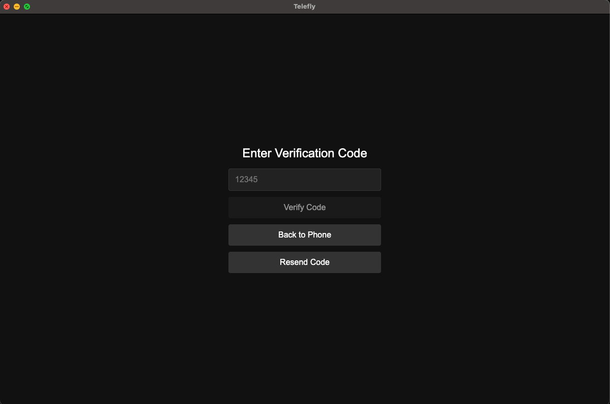
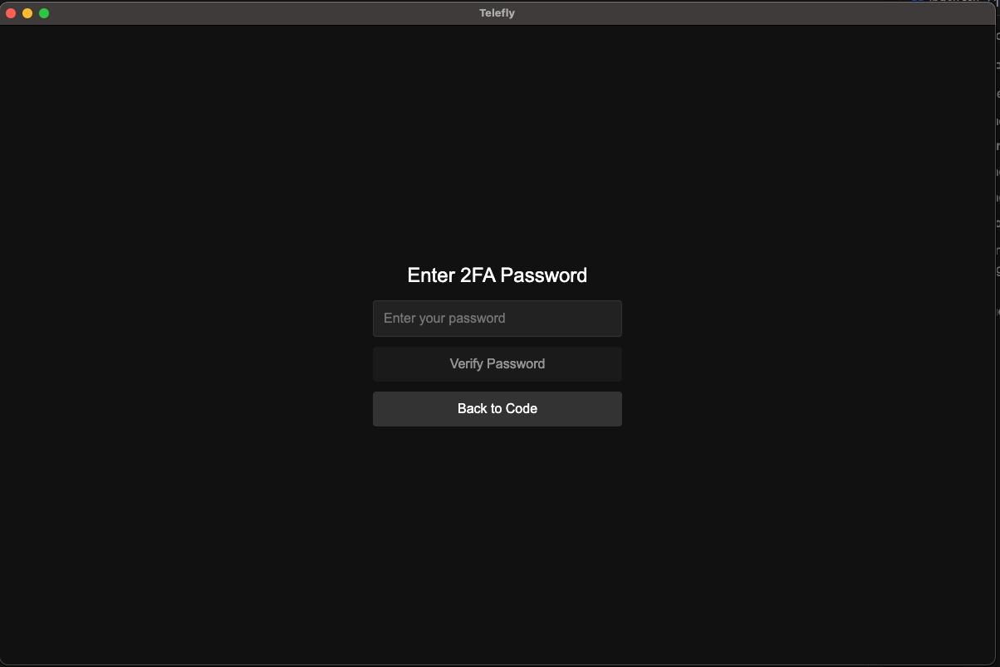
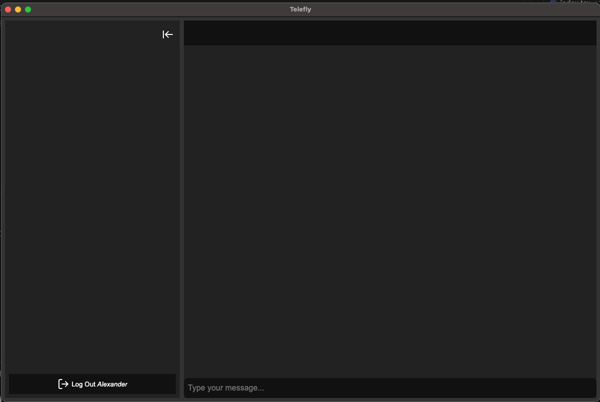

# Telefly

A cross-platform third-party desktop client for Telegram built with Electron, React, TypeScript, and Vite.

## About

Telefly is a modern, feature-rich desktop application that provides an alternative to the official Telegram desktop client. Built with Electron for cross-platform compatibility, it offers a native desktop experience while maintaining the familiar Telegram interface and functionality.

## Tech Stack

- **Frontend**: React 19 + TypeScript + Vite
- **Desktop**: Electron
- **Package Manager**: Compatible with npm, pnpm, and Bun

## Screenshots






## Roadmap

### v0.1 - In Development

- 🔄 Login (phone, QR code)
- 🔄 Logout
- 🔄 Messaging (text, photo, video, documents)

### v0.2

- 🔄 Voice messages
- 🔄 Video messages
- 🔄 Search functionality
- 🔄 Code highlighting
- 🔄 Call alternatives - meeting creation (Google Meet, Zoom, etc.)
- 🔄 Multiple accounts support

## Prerequisites

- Node.js 18+ or Bun 1.0+
- Git

## Installation

Choose your preferred package manager:

### Using npm

```bash
npm install
```

### Using pnpm

```bash
pnpm install
```

### Using Bun (recommended for faster installs)

```bash
bun install
```

## Development

### Using npm

```bash
npm run dev
```

### Using pnpm

```bash
pnpm dev
```

### Using Bun

```bash
bun run dev
```

## Build

### Using npm

```bash
npm run build
```

### Using pnpm

```bash
pnpm build
```

### Using Bun

```bash
bun run build
```

## Available Scripts

- `dev` - Start development mode (builds both renderer and main process, then starts Electron)
- `build` - Build for production
- `build:renderer` - Build React app only
- `build:electron` - Build Electron main process only
- `electron` - Run the built Electron app
- `preview` - Preview the built React app

## Project Structure

```
telefly/
├── src/                 # React app source code
├── electron/            # Electron main process and preload scripts
├── dist/                # Built React app
├── dist-electron/       # Built Electron main process
├── vite.config.ts       # Vite configuration
└── package.json         # Project configuration
```

## Development Workflow

1. The `dev` script runs three processes concurrently:
   - Vite dev server for React (port 3000)
   - TypeScript compilation for Electron
   - Electron app that connects to the dev server

2. Changes to React code will hot-reload in the Electron window
3. Changes to Electron code require restarting the dev process

## Contributing

This project is compatible with npm, pnpm, and Bun. Choose your preferred package manager:

- **npm**: Standard Node.js package manager
- **pnpm**: Fast, disk space efficient
- **Bun**: Fastest installs and runtime

All package managers will work identically for development and building.
